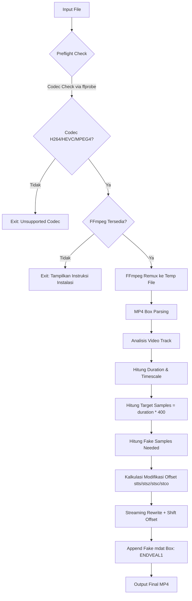

<div align="center">

# TIKTOK-OPTIMIZE

**High-performance CLI video processor untuk optimasi video TikTok ke 1080p60fps dengan rekayasa MP4 sample table tingkat lanjut.**

[](https://www.gnu.org/licenses/gpl-3.0)
[](https://www.rust-lang.org/)
[](https://ffmpeg.org/)
[]()
[]()

</div>

> [!WARNING]
> Tool ini adalah proyek eksperimental untuk tujuan edukasi dan optimasi platform. Penggunaan untuk menghindari deteksi platform atau manipulasi yang melanggar Terms of Service platform adalah tanggung jawab pengguna.

## Daftar Isi

- [Tentang Proyek](#tentang-proyek)
- [Fitur Utama](#fitur-utama)
- [Bagaimana Cara Kerjanya](#bagaimana-cara-kerjanya)
- [Arsitektur Sistem](#arsitektur-sistem)
- [Instalasi](#instalasi)
- [Penggunaan](#penggunaan)
- [Deep Dive: Video Processor Engine](#deep-dive-video-processor-engine)
- [Struktur Proyek](#struktur-proyek)
- [Konfigurasi Internal](#konfigurasi-internal)
- [Batasan dan Peringatan](#batasan-dan-peringatan)
- [Troubleshooting](#troubleshooting)
- [Roadmap](#roadmap)
- [Kontribusi](#kontribusi)
- [Lisensi](#lisensi)

---

## Tentang Proyek

**tiktok-optimize** adalah CLI tool yang dirancang khusus untuk mengoptimasi video agar sesuai dengan pipeline kompresi TikTok. Tool ini tidak hanya melakukan transcoding biasa, melainkan melakukan dua tahap pemrosesan kritis:

1.  **Remuxing via FFmpeg** untuk normalisasi container, faststart, dan metadata handler yang bersih.
2.  **Rekayasa MP4 Box-Level** untuk memanipulasi sample table (`stts`, `stsz`, `stsc`, `stco` / `co64`) sehingga kepadatan sample video ditingkatkan secara artifisial ke target 400 samples per detik.

Tujuannya adalah menghasilkan file output yang terbaca sebagai 1080p60fps dengan durasi yang sama, namun dengan struktur sample yang jauh lebih padat, meminimalisir kompresi ulang yang agresif dari platform.

Dibuat oleh [**Endveal Entertainment**](https://github.com/Endveal) dan dilisensikan di bawah **GNU GPL v3**.

---

## Fitur Utama

| Fitur | Deskripsi |
| :--- | :--- |
| **Codec-Aware Preflight** | Deteksi codec otomatis via `ffprobe`. Hanya memproses codec yang aman: `H264`, `HEVC`, `MPEG4`. Menolak `VP9`, `AV1`, `VP8`, `MPEG2`, dan `Unknown` untuk menjaga stabilitas. |
| **FFmpeg Fast Remux** | Remux tanpa re-encode (`-c copy`), dengan `+faststart` untuk streaming, dan normalisasi `handler_name` menjadi `VideoHandler` dan `SoundHandler`. |
| **RAII Temp Directory Guard** | Menggunakan pola RAII untuk manajemen direktori sementara. Direktori `endveal_{pid}_{timestamp}` otomatis terhapus saat proses selesai atau gagal, tanpa meninggalkan artefak. |
| **Low-Level MP4 Parser** | Parser MP4 box manual dari nol, tanpa library eksternal. Mendukung `ftyp`, `moov`, `trak`, `mdia`, `minf`, `stbl`, `stsz`, `stsc`, `stco`, `co64`, `stts`, `mdat`. Menangani `size=0` dan `size=1` (64-bit extended). |
| **Sample Density Engineering** | Menghitung `duration_seconds` dari `stts` dan `timescale`, lalu menghitung `target_samples = duration * 400.0`. Selisihnya diisi dengan fake samples. |
| **Zero-Copy Streaming Rewrite** | Tidak memuat seluruh file ke RAM. Menggunakan `stream_top_level` dengan buffer 1MB untuk rewrite file dengan pertumbuhan metadata yang sudah dikalkulasi sebelumnya. |
| **Cross-Platform** | Berjalan native di Windows, Linux, dan Android Termux. Satu binary, tanpa runtime tambahan selain FFmpeg. |
| **Debug Transparency** | Logging terstruktur `[INFO]`, `[DEBUG]`, `[WARN]`, `[ERROR]` untuk setiap tahap kalkulasi offset dan modifikasi. |

---

## Bagaimana Cara Kerjanya

Alur kerja tool ini terdiri dari 6 fase berurutan yang dirancang untuk keamanan dan determinisme.



### Fase 1: Preflight dan Validasi

```
[INFO] Checking for codec compatibility...
[INFO] Checking for FFmpeg availability...
[INFO] FFmpeg found! Processing with the application...
```

- Menjalankan `ffprobe -v error -select_streams v:0 -show_entries stream=codec_name`
- Memetakan string codec ke enum `VideoCodec::H264 | Hevc | Vp9 | Vp8 | Av1 | Mpeg4 | Mpeg2 | Unknown`
- Validasi path input dan output harus berbeda dan file input harus ada.

### Fase 2: FFmpeg Video Remux

Perintah yang dieksekusi secara internal:

```bash
ffmpeg -y -hide_banner -loglevel error \
  -i input.mp4 \
  -map 0:v:0 -map 0:a:0? \
  -c copy \
  -map_metadata 0 \
  -movflags +faststart \
  -metadata:s:v:0 handler_name=VideoHandler \
  -metadata:s:a:0 handler_name=SoundHandler \
  /tmp/endveal_.../ffmpeg-remux.mp4
```

Tujuan: membersihkan struktur atom yang tidak standar, memindahkan `moov` ke depan file untuk faststart, dan memastikan handler name konsisten.

### Fase 3: MP4 Sample Table Engineering

Ini adalah inti dari tool ini, terletak di `engine.rs`.

| Atom | Peran dalam Proses |
| :--- | :--- |
| `stsz` | Menyimpan ukuran setiap sample. Akan diperbesar `sample_count`-nya. |
| `stsc` | Sample-to-Chunk mapping. Akan ditambahkan entri baru untuk fake chunks. |
| `stco` / `co64` | Chunk offset table (32-bit / 64-bit). Semua offset asli akan di-shift sesuai pertumbuhan metadata, dan offset fake akan ditambahkan. |
| `stts` | Time-to-Sample. Di-rebuild untuk real samples saja dengan aturan: `N-1 sample pertama menggunakan fixed_delta`, `sample terakhir menggunakan delta=1`. Fake samples tidak direpresentasikan di `stts`. |
| `mdat` | Media data. Di akhir file akan ditambahkan `mdat` baru berukuran 16 byte berisi payload `ENDVEAL1`. |

#### Kalkulasi Matematis

```rust
pub const TARGET_SAMPLE_DENSITY: f64 = 400.0;
pub const FAKE_BYTES: [u8; 8] = *b"ENDVEAL1";

duration_seconds = total_duration_ticks / video_timescale
target_samples = duration_seconds * 400.0
fake_samples = target_samples.round() - real_samples
metadata_growth = sum(delta_modifikasi)
fake_payload_offset = file_len + metadata_growth + 8 // 8 = header mdat
final_len = file_len + metadata_growth + 16 // 16 = header + payload fake mdat
```

Semua fake chunk offset akan menunjuk ke `fake_payload_offset` yang sama. Ini adalah teknik shared payload untuk efisiensi.

---

## Arsitektur Sistem

```
tiktok-optimize/
├── Cargo.toml          # Manifest package, name: tiktok-optimize
├── src/
│   ├── main.rs         # Orchestrator utama, preflight, codec detection, workflow
│   └── core/
│       ├── mod.rs      # Module aggregator
│       ├── cli.rs      # Argument parser minimalis tanpa dependency pihak ketiga
│       ├── ffmpeg.rs   # Wrapper eksekusi FFmpeg remux
│       ├── temp_guard.rs # RAII guard untuk temp directory
│       └── engine.rs   # Core engine: MP4 box parsing & streaming rewrite
```

### Tanggung Jawab Modul

**`core::cli`**
- Parser argumen posisional murni: `<input> <output>`
- Mendukung `-h | --help` dan `-v | --version`
- Menangani `--` sebagai end-of-options
- Zero dependency, menggunakan `std::env::args`

**`core::temp_guard::TempDirGuard`**
```rust
pub struct TempDirGuard { path: PathBuf }

impl TempDirGuard {
    pub fn new(prefix: &str) -> Result<Self, Box<dyn Error>>
    pub fn path(&self) -> &Path
}
impl Drop for TempDirGuard {
    fn drop(&mut self) { fs::remove_dir_all() } // Auto cleanup
}
```
Path format: `{temp_dir}/endveal_{pid}_{secs}_{nanos}`

**`core::ffmpeg::ffmpeg_video_remux`**
- Wrapper `Command::new("ffmpeg")`
- Logging debug semua argumen
- Error handling dengan stderr capture

**`core::engine`**
- Struktur data: `VideoInfo`, `BoxHeader`, `FourCC`, `Modification`
- Fungsi utama: `read_box_header`, `find_video_info`, `calculate_modifications`, `stream_top_level`
- Penanganan overflow dengan `checked_add_u64`
- Support `stco` 32-bit dan `co64` 64-bit

---

## Instalasi

### Prasyarat

Tool ini membutuhkan FFmpeg dan FFprobe terinstal dan tersedia di `PATH`.

#### Windows

```powershell
# Opsi 1: Via winget (Administrator)
winget install Gnu.FFmpeg

# Opsi 2: Manual
# 1. Download dari https://ffmpeg.org
# 2. Extract zip
# 3. Tambahkan folder bin ke System Environment Variables PATH
```

#### Linux

```bash
# Ubuntu / Debian
sudo apt update && sudo apt install ffmpeg

# Arch Linux
sudo pacman -S ffmpeg

# Fedora
sudo dnf install ffmpeg
```

#### Android Termux

```bash
pkg install ffmpeg
```

### Build dari Source

```bash
# Clone repository
git clone https://github.com/endveal/tiktok-optimize.git
cd tiktok-optimize

# Build release (optimized)
cargo build --release

# Binary akan ada di
./target/release/tiktok-optimize

# Verifikasi instalasi
./target/release/tiktok-optimize --version
ffmpeg -version
```

---

## Penggunaan

### Sintaks Dasar

```bash
tiktok-optimize <input> <output>
```

| Argumen | Deskripsi | Wajib |
| :--- | :--- | :--- |
| `<input>` | Path file video input | Ya |
| `<output>` | Path file video output, harus berbeda dari input | Ya |
| `-h, --help` | Menampilkan bantuan penggunaan | Tidak |
| `-v, --version` | Menampilkan versi tool | Tidak |

### Contoh Penggunaan

```bash
# Penggunaan paling sederhana
tiktok-optimize video_asli.mp4 video_optimized.mp4

# Dengan path absolut
tiktok-optimize /home/user/videos/raw.mp4 /home/user/videos/final_tiktok.mp4

# Di Windows
tiktok-optimize.exe C:\Users\Endveal\Videos\input.mp4 C:\Users\Endveal\Videos\output.mp4

# Melihat bantuan
tiktok-optimize --help

# Output:
# Tiktok video optimize - 1080p60fps, CLI version
#
# Usage:
#   tiktok-optimize <input> <output>
```

### Contoh Output Log Lengkap

```
[INFO] Checking for codec compability...
[INFO] Checking for FFmpeg availability...
[INFO] FFmpeg found! Processing with the application...
[INFO] input  : video_asli.mp4
[INFO] output : video_optimized.mp4
[DEBUG] -y -hide_banner -loglevel error -i video_asli.mp4 -map 0:v:0 -map 0:a:0? -c copy -map_metadata 0 -movflags +faststart -metadata:s:v:0 handler_name=VideoHandler -metadata:s:a:0 handler_name=SoundHandler /tmp/endveal_1234_.../ffmpeg-remux.mp4
[INFO] stsz: offset=1234 size=5678 sample_size=0 sample_count=1800
[INFO] stsc: offset=2345 size=1234 entries=5 last_desc_id=5 chunk_count=10
[INFO] stco: offset=3456 size=789 samples=10 original_chunks=10
[INFO] stts: entries=2 samples=1800 fixed_delta=512 (first original delta)
[INFO] video timescale       : 15360
[INFO] duration ticks       : 921600
[INFO] duration seconds     : 60.000000
[INFO] real samples         : 1800
[INFO] target samples       : 24000
[INFO] target density       : 400 samples/sec
[INFO] fake samples needed  : 22200
[INFO] metadata growth: +88800 bytes
[DEBUG] insertion/growth at old file offset 1234: +88800 bytes
[INFO] fake payload is at final file offset 12345678 (8 bytes)
[INFO] output size will be 12345694 bytes
[INFO] done: 12345694 bytes written
[INFO] fake samples added: 22200
[INFO] stsz new sample_count: 24000
[INFO] fake chunks added to stco: 22200
[INFO] stts rebuilt for real samples only: 1800 samples
[INFO] stts rule: samples 1..N-1 use delta=512, last sample uses delta=1
[INFO] fake samples are NOT represented in stts
[INFO] fake sample size: 8 bytes; all fake chunk offsets are identical
[INFO] stts atom growth: +0 bytes

[WARN] This intentionally creates a non-conformant/experimental MP4 sample table:
       stts describes the original real samples only; fake samples are added to stsz/stsc/stco(or co64).
       Multiple fake chunks point to the same 8-byte payload.
       Some parsers may ignore the extra samples; others may reject the file or behave differently.
```

---

## Deep Dive: Video Processor Engine

### 1. Deteksi Codec

```rust
pub enum VideoCodec { H264, Hevc, Vp9, Vp8, Av1, Mpeg4, Mpeg2, Unknown }

pub fn detect_video_codec(input: &str) -> Result<VideoCodec, Box<dyn Error>>
```

Menggunakan `ffprobe` dengan output `default=noprint_wrappers=1:nokey=1` untuk mendapatkan `codec_name` stream video pertama. Hanya `H264`, `Hevc`, dan `Mpeg4` yang diizinkan melanjutkan proses.

### 2. MP4 Box Parsing

Parser bekerja secara rekursif:

```rust
fn find_video_info(file: &mut File, start: u64, end: u64, in_video_trak: bool, info: &mut VideoInfo)
```

- Membaca header 8 byte: `size:u32` + `type:FourCC`
- Jika `size == 1`, baca extended size 64-bit (total header 16 byte)
- Jika `size == 0`, box extends sampai akhir container
- Cek apakah container: `moov`, `trak`, `mdia`, `minf`, `stbl`
- Cek video trak via `hdlr` handler type `vide`
- Simpan offset `stsz`, `stsc`, `stco`/`co64`, `stts`, dan `trak`

### 3. Kalkulasi Modifikasi

```rust
pub fn calculate_modifications(file_len: u64, info: &VideoInfo, fake_samples: u32)
  -> Result<(Vec<Modification>, u64), Box<dyn Error>>
```

Menghitung pertumbuhan ukuran untuk setiap atom:

- `stsz`: `+ fake_samples * 4` jika `sample_size == 0`, atau tidak tumbuh jika constant size
- `stsc`: `+ 12 bytes` untuk satu entri baru (jika chunk count bertambah)
- `stco`: `+ fake_samples * 4` atau `co64`: `+ fake_samples * 8`
- `stts`: Rebuild total, pertumbuhan tergantung konsolidasi entry

Setiap modifikasi dicatat sebagai:

```rust
pub struct Modification { pub offset: u64, pub delta: u64 }
```

### 4. Streaming Rewrite

```rust
pub fn stream_top_level(input: &mut File, output: &mut File, file_len: u64, mods: &[Modification], ...)
```

- Tidak memuat file ke memori
- Copy range per box dengan penyesuaian ukuran
- Untuk `stsz`, `stsc`, `stco`/`co64`, `stts`: tulis versi modifikasi
- Untuk box lain yang mengandung offset (seperti box `stco` tambahan di audio track): shift offset-nya dengan `sum_deltas_before()`
- Untuk box container: rekursif proses child-nya

Fungsi helper penting:

| Fungsi | Deskripsi |
| :--- | :--- |
| `read_u32_at` / `read_u64_at` | Membaca big-endian integer di offset tertentu |
| `write_box_size` | Menulis ukuran box baru dengan handling 32-bit vs 64-bit |
| `copy_range` | Copy 1MB chunked dari input ke output |
| `sum_deltas_before` | Menghitung total pertumbuhan metadata sebelum offset tertentu |
| `checked_add_u64` | Penjumlahan aman dengan error handling overflow |

### 5. Fake mdat Append

Di akhir proses di `main.rs`:

```rust
output.write_all(&16u32.to_be_bytes()) // size = 16
output.write_all(b"mdat")              // type
output.write_all(&FAKE_BYTES)          // payload = b"ENDVEAL1"
```

Semua fake chunk di `stco`/`co64` menunjuk ke offset payload ini. Ukuran 8 byte dipilih agar tetap valid sebagai sample dan tidak boros.

---

## Struktur Proyek

```
.
├── Cargo.toml
├── README.md
└── src/
    ├── main.rs
    └── core/
        ├── mod.rs
        ├── cli.rs
        ├── engine.rs
        ├── ffmpeg.rs
        └── temp_guard.rs
```

Deskripsi file:

| File | Baris Kode (approx) | Tanggung Jawab |
| :--- | :--- | :--- |
| `main.rs` | 450 | Orchestrasi, preflight, workflow utama, final append |
| `cli.rs` | 88 | Parsing argumen CLI |
| `ffmpeg.rs` | 70 | Eksekusi FFmpeg remux |
| `temp_guard.rs` | 60 | RAII temp directory |
| `engine.rs` | 900 | Parser MP4 dan engine rekayasa sample table |
| `mod.rs` | 20 | Module declaration |

---

## Konfigurasi Internal

Konstanta yang dapat diubah di source code untuk eksperimen lanjutan:

| Konstanta | Lokasi | Nilai Default | Deskripsi |
| :--- | :--- | :--- | :--- |
| `FFMPEG_PATH` | `main.rs` | `"ffmpeg"` | Binary FFmpeg yang digunakan |
| `TEMP_FILE_PREFIX` | `main.rs` | `"endveal_"` | Prefix direktori temp |
| `TARGET_SAMPLE_DENSITY` | `engine.rs` | `400.0` | Target kepadatan sample per detik |
| `FAKE_BYTES` | `engine.rs` | `*b"ENDVEAL1"` | Payload 8 byte untuk fake sample |
| `COPY_BUF_SIZE` | `engine.rs` | `1024 * 1024` | Buffer copy 1MB |

Untuk mengubah target density menjadi 600:

```rust
// di engine.rs
pub const TARGET_SAMPLE_DENSITY: f64 = 600.0;
```

Lalu rebuild: `cargo build --release`

---

## Batasan dan Peringatan

1.  **File Non-Conformant**: Output yang dihasilkan sengaja tidak sepenuhnya sesuai spesifikasi ISO BMFF. `stts` hanya mendeskripsikan real samples, sedangkan `stsz`/`stsc`/`stco` mencakup fake samples. Beberapa player atau validator mungkin menolak file ini. TikTok sendiri terbukti dapat memprosesnya, namun kompatibilitas tidak dijamin untuk platform lain.

2.  **Codec Terbatas**: Hanya `H264`, `HEVC`, dan `MPEG4` yang didukung. `VP9`, `AV1`, `VP8` akan ditolak di preflight. Ini adalah keputusan desain untuk menjaga stabilitas `stts` rebuilding.

3.  **Risiko Overflow**: Jika `fake_samples` melebihi `u32::MAX` atau `fake_payload_offset` melebihi `u32::MAX` untuk file `stco`, proses akan dihentikan dengan error. File yang sudah menggunakan `co64` aman dari batas 32-bit.

4.  **Tidak Melakukan Transcode**: Tool ini tidak mengubah resolusi atau framerate secara nyata. Tool ini mengubah metadata sample table agar terbaca sebagai 60fps dengan kepadatan tinggi. Pastikan input Anda sudah 1080p60fps sebelum diproses.

5.  **Kebutuhan Disk**: Membutuhkan ruang disk 2x ukuran file input + pertumbuhan metadata selama proses (karena file temp).

---

## Troubleshooting

| Pesan Error | Penyebab | Solusi |
| :--- | :--- | :--- |
| `Codec not supported; wait for the maintainer to update.` | Codec video adalah VP9/AV1/VP8/MPEG2 | Convert dulu ke H264: `ffmpeg -i input.webm -c:v libx264 -crf 18 -preset fast temp.mp4` |
| `FFmpeg is not installed or not found in your system's PATH!` | FFmpeg tidak terdeteksi | Ikuti instruksi instalasi di bagian Instalasi |
| `Input file not found` | Path input salah | Cek path absolut dan permission file |
| `The input and output must be different files` | Input dan output path sama | Gunakan nama file output yang berbeda |
| `ffprobe failed` | File bukan video valid atau rusak | Coba `ffprobe input.mp4` manual untuk cek |
| `no video stream found` | File tidak mengandung video track | Pastikan file adalah video, bukan audio saja |
| `fake sample count too large for u32` | Video sangat panjang dengan density 400 | Turunkan `TARGET_SAMPLE_DENSITY` atau potong durasi video |
| `fake payload offset exceeds stco 32-bit range` | File output > 4GB dengan stco | Gunakan input yang sudah co64 atau remux ke co64: `ffmpeg -i input.mp4 -movflags use_metadata_tags -c copy temp.mp4` |

---

<!-- ## Roadmap

- [ ] **v0.2.0**: Dukungan batch processing untuk folder
- [ ] **v0.2.0**: Flag `--density` untuk mengatur `TARGET_SAMPLE_DENSITY` dari CLI tanpa recompile
- [ ] **v0.3.0**: Integrasi `clap` untuk CLI yang lebih kaya dengan progress bar
- [ ] **v0.3.0**: Deteksi otomatis `co64` vs `stco` dan konversi otomatis
- [ ] **v0.4.0**: Mode dry-run untuk menampilkan kalkulasi tanpa menulis file
- [ ] **v0.5.0**: Validasi output dengan `mp4box.js` parser dan laporan kompatibilitas -->

---

## Kontribusi

Kontribusi sangat terbuka. Karena proyek ini berlisensi GPL v3, semua kontribusi juga akan berlisensi GPL v3.

1.  Fork repository ini
2.  Buat branch fitur: `git checkout -b feat/nama-fitur`
3.  Commit perubahan: `git commit -m "feat: tambah fitur X"`
4.  Push branch: `git push origin feat/nama-fitur`
5.  Buka Pull Request

Pastikan:

- `cargo fmt` dan `cargo clippy` lolos tanpa warning
- Tambahkan test untuk logic MP4 parsing baru
- Update README jika mengubah perilaku CLI

---

## Lisensi

Copyright (C) 2026 Endveal Entertainment

Proyek ini dilisensikan di bawah **GNU General Public License v3.0** - lihat file `LICENSE` untuk detail lengkap.

```
This program is free software: you can redistribute it and/or modify
it under the terms of the GNU General Public License as published by
the Free Software Foundation, either version 3 of the License, or
(at your option) any later version.

This program is distributed in the hope that it will be useful,
but WITHOUT ANY WARRANTY; without even the implied warranty of
MERCHANTABILITY or FITNESS FOR A PARTICULAR PURPOSE.
```

---

## Kredit

- **Engine Core**: Endveal Entertainment
- **FFmpeg**: Proyek FFmpeg - https://ffmpeg.org
- **Rust**: Rust Programming Language - https://rust-lang.org

---

**Catatan**: Tool ini adalah proyek eksperimental untuk tujuan edukasi dan optimasi platform. Penggunaan untuk menghindari deteksi platform atau manipulasi yang melanggar Terms of Service platform adalah tanggung jawab pengguna.
